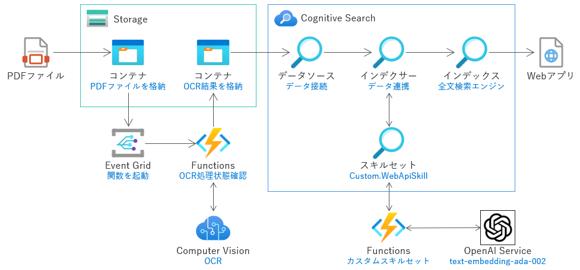

# 必要な環境
- [Azure CLI](https://docs.microsoft.com/ja-jp/cli/azure/install-azure-cli)
- [Azure Bicep](https://docs.microsoft.com/ja-jp/azure/azure-resource-manager/bicep/install)
- [.NET 6.0](https://dotnet.microsoft.com/ja-jp/download/dotnet/6.0)
- [Azure Functions Core Tools ](https://learn.microsoft.com/ja-jp/azure/azure-functions/functions-run-local)
- bash が実行できるコンソール (Windows だと [Git Bash](https://gitforwindows.org/) など)

# デプロイ方法

必要な環境を用意し、設定(Azure CLI での Azure テナントへログインなど)を行った後に、以下の様に、第一引数にリソースグループ名を指定して ```deploy.sh``` スクリプトを実行します。
```bash
./deploy.sh [リソースグループ名]
# 例： ./deploy.sh rg-pdf-vector-search
```
# 展開される Azure アーキテクチャ
